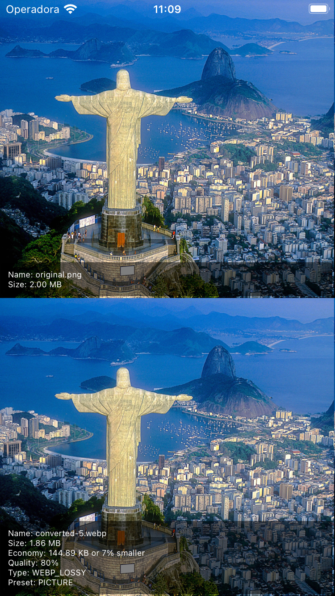

# react-native-webp-converter

Easily convert PNG and JPG images to WebP format for improved image optimization and performance in React Native applications.

WebP is a modern image format that provides superior compression, saving on file size without compromising quality, making it ideal for mobile apps where performance and storage are key.

## Features

- **PNG/JPG to WebP** conversion.
- Custom hook `useConverter()` for easy in-component conversion.
- `convertImage()` method for more controlled use cases.
- Configurable options for **quality**, **type** (lossy/lossless), and **preset**.

## Demo

### Quality comparison

Below is a top-to-bottom comparison, with the original image at the top and the compressed version at the bottom.

#### Low Quality Setting(quality = 5)

<a href="./docs/assets/quality-5.png?raw=true">
  
</a>

#### High Quality Settings(quality = 80)

<a href="./docs/assets/quality-80.png?raw=true">
 
</a>

## Installation

```sh
npm install react-native-webp-converter
```

or

```sh
yarn add react-native-webp-converter
```

## Usage

### Using `convertImage`

```ts
import * as WebP from 'react-native-webp-converter'
import * as fs from 'react-native-fs';
import { useCallback, useEffect, useState } from 'react';
import { ActivityIndicator, Image, StyleSheet } from 'react-native';

export default function App() {
  const [convertedImage, setConvertedImage] = useState('');

  const convertImage = useCallback(async () => {
    const inputPath = `path-to-my-local-image.png`;
    const outputPath = `${fs.CachesDirectoryPath}/my-image-converted.webp`;

    await WebP.convertImage(inputPath, outputPath, {
      quality: 80,
      type: WebP.Type.LOSSY,
      preset: WebP.Preset.PICTURE,
    });

    setConvertedImage(outputPath);
  }, []);

  useEffect(() => {
    convertImage();
  }, []);

  if (!convertedImage) return <ActivityIndicator />;

  return (
    <Image
      source={{ uri: `file://${convertedImage}` }}
      style={StyleSheet.absoluteFill}
      resizeMode="cover"
    />
  );
}
```

### Example Config Object

```ts
const config: WebP.WebPConfig = {
  quality: 80,
  type: WebP.Type.LOSSY,
  preset: WebP.Preset.PICTURE,
};
```

## API

```tsx
import * as WebP from 'react-native-webp-converter';
```

### Methods

#### `convertImage(inputPath, outputPath, config)`

| **Argument** | **Type**          | **Description**                                     |
| ------------ | ----------------- | --------------------------------------------------- |
| `inputPath`  | `string`          | Path to the input image file.                       |
| `outputPath` | `string`          | Desired path for the output WebP file.              |
| `config`     | `WebPConfig`      | Configuration options.                              |
| **Returns**  | `Promise<string>` | Resolves to the output path of the converted image. |

---

## Configuration Options

| Property  | Type          | Required | Description                                                                            |
| --------- | ------------- | -------- | -------------------------------------------------------------------------------------- |
| `quality` | `number`      | Yes      | Defines the compression quality (0-100).                                               |
|           |               |          | **Lossy**: Represents visual quality; higher values produce better quality.            |
|           |               |          | **Lossless**: Indicates compression efficiency; higher values result in smaller files. |
| `type`    | `WebP.Type`   | Yes      | Sets compression type.                                                                 |
|           |               |          | **`Type.LOSSY`**: Lossy compression.                                                   |
|           |               |          | **`Type.LOSSLESS`**: Lossless compression.                                             |
| `preset`  | `WebP.Preset` | No       | Adjusts compression settings based on image type (iOS only).                           |
|           |               |          | **`Preset.DEFAULT`**: Standard preset.                                                 |
|           |               |          | **`Preset.PICTURE`**: Ideal for portraits or indoor shots.                             |
|           |               |          | **`Preset.PHOTO`**: Best for natural outdoor photography.                              |
|           |               |          | **`Preset.DRAWING`**: Suited for line art or drawings.                                 |
|           |               |          | **`Preset.ICON`**: For small, colorful icons.                                          |
|           |               |          | **`Preset.TEXT`**: For images containing text.                                         |

---

## Interfaces

### `WebPConfig`

Defines the configuration for image conversion.

```ts
type WebPConfig = {
  quality: number;
  type: WebP.Type;
  preset?: WebP.Preset;
};
```

### Enums

#### `Type`

Compression types for image conversion.

```ts
enum Type {
  LOSSY,
  LOSSLESS,
}
```

#### `Preset`

Specifies the compression preset based on image type.

```ts
enum Preset {
  DEFAULT, // Default preset
  PICTURE, // Portrait or indoor shots
  PHOTO, // Outdoor, natural photos
  DRAWING, // Drawings or high-contrast images
  ICON, // Small, colorful images (icons)
  TEXT, // Text-like images
}
```

## Contributing

To contribute, see the [contributing guide](CONTRIBUTING.md) for setup and pull request guidelines.

## License

Licensed under the MIT License.

---
